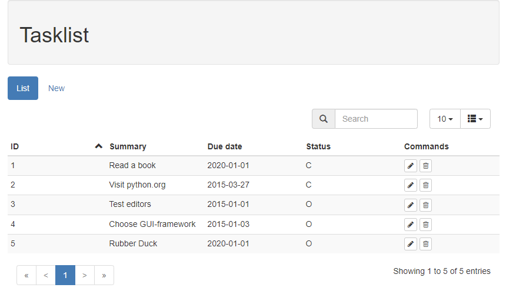

# RESTful web service example

Ever wondered how to build a web service and how to communicate with it? Then have a look at this Python project which contains:
- A minimal RESTful web service (*server.py*) to maintain a todo list. Only four calls are implemented: retrieving the content of one or all tasks and adding, editing and deleting tasks.
- An app which provides a web-UI (*client.py*) to view and maintain the todo list, using calls to the web service.

The web service and UI-app are built using the *Bottle* web framework.
All responses from the web service are structured following the *JSend* conventions (see: https://github.com/omniti-labs/jsend).
The Bottle web page templates (*.tpl) are built on top of the Bootstrap framework.

Within this project the directory structure for the web service and the UI application server are mixed.
See below the relevant parts for each of them. Note that certain files are used for both the UI and the server.

##### WEB service

    db\
        __init__.py
        task.py
    jsend.py
    server.py

    todo.db
    todo.sql

The core code of the web service resides in *server.py*. Task information is read from - and written to the *task* table in an SQLite database via calls to *db\task.py*. When the web service is started it first tries to connect to the task database. If this database cannot be found - either because it really is not there or you've chosen to connect to an in-memory database - SQL file todo.sql will be executed. It contains the statements needed to create and fill the todo database. If you want to take a look at the database itself I recommend using freeware SQLite database manager SQLiteStudio.

When successful a call to the webservice, like retrieving the information for task 1 via http://127.0.0.10:8080/task/1, will return:
```
{"status": "success",
  "data": {"id": 1, "summary": "Read", "description": "Read something to get a good introduction into Python",
           "duedate": "2020-01-01", "status_id": "C", "modified": "2017-09-18T09:10:20"}}
```

An unsuccessful calls' return value looks like:
```
{"status": "fail", "data": "task 10 not found"}
```

##### UI application server

    api\
        __init__.py
        task.py
    views\
        *.tpl
    jsend.py
    client.py

File *client.py* contains the app server. Calls to the web service are made via *api\task.py*. Directory *views* contains the html code of the various web pages.

The landing page of the UI looks like:



To run the server and the GUI use the Windows command prompt:
```
> start python server.py
> start python client.py
```
The server listens to address 127.0.0.10:8080. To view the UI start your browser and visit localhost:8080.
In the implementation as uploaded here the tasks database *todo.db* is not needed. Whenever the server is started an in-memory SQLite database is created and populated from todo.sql. In this way you can experiment without destroying data.

##### References

* http://www.restapitutorial.com/
* https://labs.omniti.com/labs/jsend
* https://www.toptal.com/bottle/building-a-rest-api-with-bottle-framework
